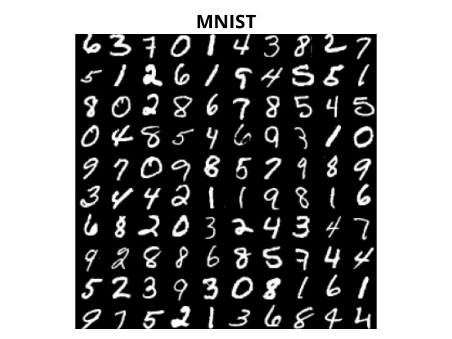
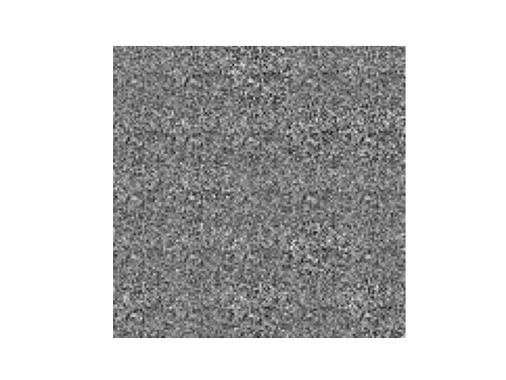

# <h1 align="center">**GAN**</h1>

 

This repository contains the implementation of [Generative Adversarial Networks (GANs)](https://papers.nips.cc/paper/5423-generative-adversarial-nets.pdf). GANs are a deep learning framework that captures the distribution of training data to generate similar new data. They consist of two models: a generator and a discriminator.

## **Components of a GAN**

- **Generator:** Its role is to create "fake" images that resemble real images used in training. During the training process, the generator continually strives to deceive the discriminator, consistently improving the quality of the forgeries it produces. Balance is achieved when the generator is able to generate perfect forgeries that are indistinguishable from the real images used in the training dataset.

- **Discriminator:** Its task is to determine whether a given image is real or a forgery generated by the generator. During training, the discriminator is trained to be a more effective "detective," learning to properly classify images as real or fake. Balance is achieved when the discriminator cannot distinguish between real images and those generated by the generator, and therefore, always has a 50% probability of determining whether a given image is real or fake.

# **Dataset Configuration**
The dataset used is MNIST, which consists of a training set of 60,000 handwritten digit images (from 0 to 9), and an additional test set of 10,000 samples. Accessing this dataset is straightforward through libraries such as TensorFlow Datasets and PyTorch Datasets.

## **Implementations in TensorFlow and PyTorch**
Implementations have been done in both TensorFlow and PyTorch, the two most widely used frameworks in Deep Learning, to explore the capabilities of GANs. Each implementation provides insights into the differences and similarities between these frameworks, offering practical perspectives for professionals in the field.

- [TensorFlow Notebook](GAN_MNIST_TensorFlow.ipynb)

- [PyTorch Notebook](GAN_MNIST_PyTorch.ipynb)

## **Generated Examples**

 

*The quality of digit generation improves as epochs progress, but after 100 epochs, the generations are not as good, and there is mode collapse with the digits 3 and 8, where the model exclusively generates these digits and fails to generalize properly. For better results in just 20 epochs, you can visit the [DCGANs](https://github.com/JersonGB22/DCGAN-TensorFlow-PyTorch) implementation and even better, the [Conditional GANs](https://github.com/JersonGB22/CondicionalGAN-TensorFlow-PyTorch) in my repositories.*

## **Technological Stack**
 

## **Contact**

